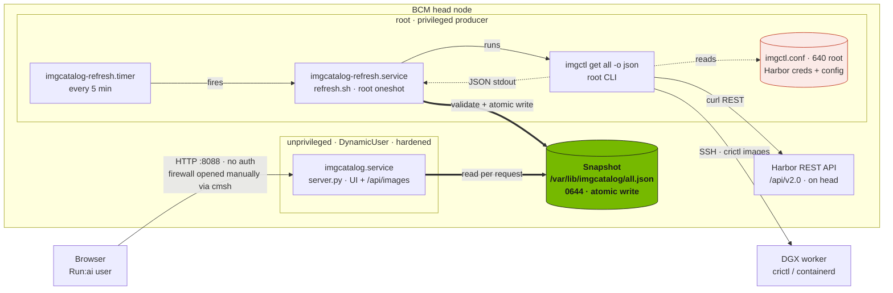
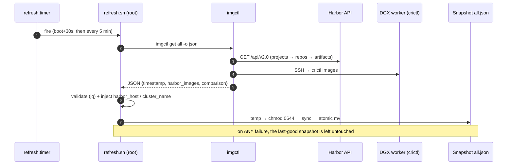
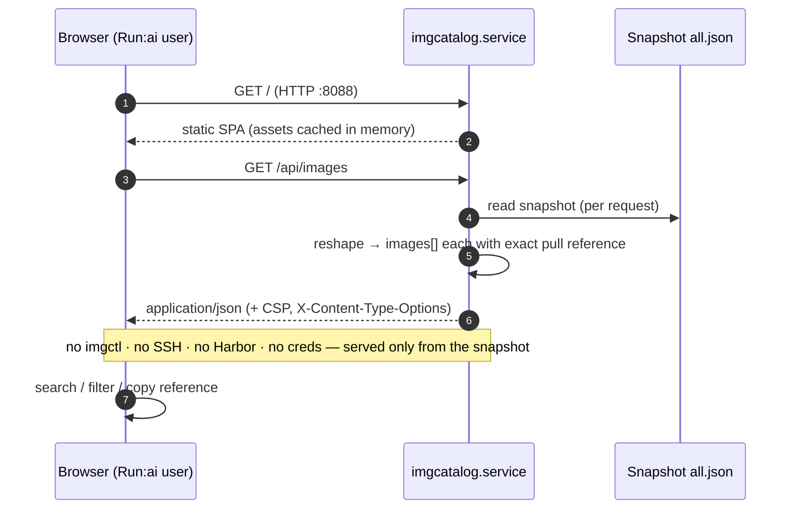

# Cluster Image Portal — Architecture & Sequence Diagrams

> Web GUI component of `imgctl` (v2.2.0). Short visual reference for admins and developers.
> A rendered PDF of this file is at [`Cluster-Image-Portal-Architecture.pdf`](Cluster-Image-Portal-Architecture.pdf).

**The one idea:** a **root producer** collects images on a timer and atomically writes a
JSON **snapshot**; an **unprivileged web service** only *reads* that snapshot. They share one
file and nothing else — so the public, no-auth web tier never runs `imgctl`, never SSHes, and
never sees Harbor credentials.

---

## 1. Architecture

---

## 2. Sequence — refresh path (root producer, periodic)

---

## 3. Sequence — request path (unprivileged web tier)

---

## 4. Components & responsibilities

| Component | Runs as | Triggered by | Reads | Writes | Purpose |
|---|---|---|---|---|---|
| `imgcatalog-refresh.timer` | systemd | boot + every 5 min | — | — | Fires the refresh oneshot (`Persistent=true`) |
| `imgcatalog-refresh.service` → `refresh.sh` | **root** (oneshot) | the timer | `imgctl.conf` | the snapshot | Run imgctl, validate, atomically publish |
| `imgctl` | **root** (CLI) | `refresh.sh` | `imgctl.conf` | stdout → temp | Query Harbor API + `crictl` over SSH |
| Harbor REST API | service on head | imgctl | — | — | Source: custom/registry images |
| DGX worker `crictl` | on worker (via SSH) | imgctl | — | — | Source: node-cached NGC/Docker images |
| Snapshot `all.json` | file (`0644`) | — | by web tier | by `refresh.sh` | The decoupling seam (one JSON file) |
| `imgcatalog.service` → `server.py` | **unprivileged** `DynamicUser` (hardened) | always-on (`Restart=always`) | the snapshot | — | Serve UI + JSON API |
| Browser | client | user | `/`, `/api/images` | — | Browse + copy pull reference |

**API endpoints:** `GET /` (UI) · `GET /api/images` (flattened JSON, exact `reference` per image) · `GET /api/raw` (imgctl passthrough) · `GET /healthz` · `GET /version`. Non-GET/HEAD → `405`.

**Key paths / ops:** snapshot `/var/lib/imgcatalog/all.json`; units `imgcatalog.service` + `imgcatalog-refresh.timer`; install via `install.sh`; **firewall opened manually** via `cmsh … openports` (never hand-edit `/etc/shorewall/rules`).

**Security note:** the portal has **no authentication** and binds `0.0.0.0:8088` (plain HTTP) — access is gated **only by the firewall port**. The web tier is sandboxed (`DynamicUser`, `NoNewPrivileges`, empty `CapabilityBoundingSet`, `ProtectSystem=strict`, `MemoryMax`/`CPUQuota`/`TasksMax`, in-process connection cap) and is **read-only** — it exposes image names/tags/sizes only.
